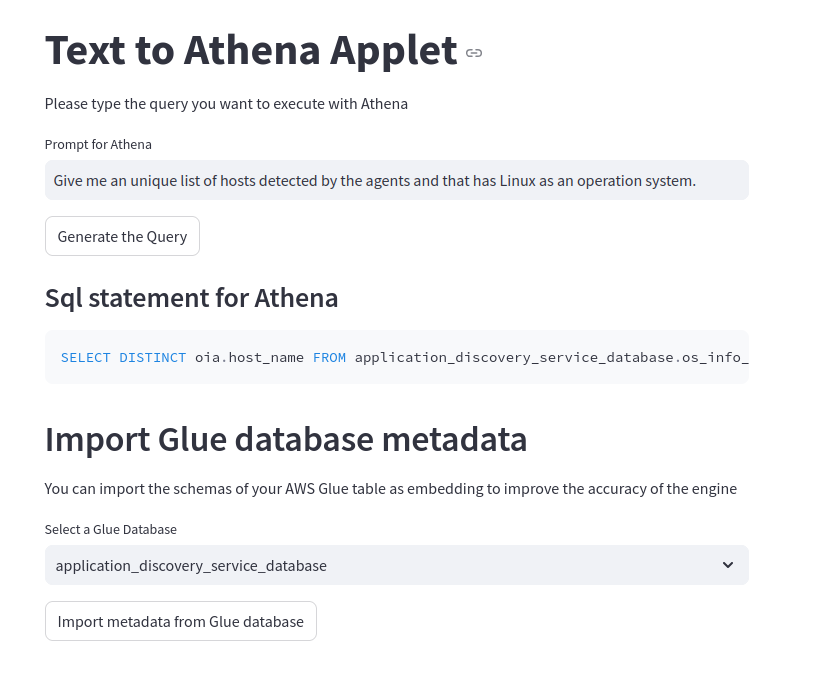

## Streamlit Applet using Bedrock for robust Text-to-SQL solution and Amazon Athena

This is the repo that is based on the AWS AI/ML Blog Post: https://aws.amazon.com/blogs/machine-learning/build-a-robust-text-to-sql-solution-generating-complex-queries-self-correcting-and-querying-diverse-data-sources/

The purpose is to offer a simple UI to generate SQL Queries for Amazon Athena based on your AWS Glue Databases and tables metadata.

The main differences are : 

* the usage of chroma.db as a vector database 
* a mechanism to automatically import the Glue Table schemas automatically in the vector database
* an integration with Bedrock to generate the column and table metadata to improve the accuracy of the Athena Sql queries that are generated
* a [Streamlit](https://streamlit.io/) applet to generate the Athena queries and index your AWS Glue tables

### 1)	Introduction

Structured Query Language (SQL) is a complex language that needs both understanding of database, metadata and SQL language. Today, Generative AI can enable people without SQL knowledge. This task is called, Text-to-SQL, generating SQL queries from natural language processing (NLP) and converting text into a semantically correct SQL. The presented solution in this post aims to bring enterprise analytics operations to the next level by shortening the path to your data using natural language. 

However, the task of Text-to-SQL presents various challenges. At its core, the difficulty arises from the inherent differences between human language, which is ambiguous, and context-dependent, and SQL, being precise, mathematical and structured. With the emergence of Large Language Models (LLMs), the Text-to-SQL landscape has undergone a significant transformation. Demonstrating an exceptional performance, LLMs are now capable of generating accurate SQL queries from natural language descriptions. The larger adoption of centralized analytics solutions, such as data-mesh, -lakes and -warehouses, customers start to have quality metadata which provides extra input to LLMs to build better Text-to-SQL solutions. Finally, customers need to build this SQL solutions for every data-base because data is not stored in a single location. Hence, even if the customers build Text-to-SQL, they had to do it for all data-sources given the access would be different. You can learn more about the Text-to-SQL best practices and design patterns.

This post will address those challenges. First, we will include the meta-data of the data sources to increase the reliability of the generated SQL query. Secondly, we will use a final loop for evaluation and correction of SQL queries to correct the SQL query, if it is applicable. Here, we will utilize the error messages received from Amazon Athena which will make the correction prompting more coincide. Amazon Athena also allows us to utilize Athena’s supported endpoints and connectors to cover a large set of data sources. After we build the solution, we will test the Text-to-SQL capability at different realistic scenarios with varying SQL complexity levels. Finally, we will explain how a different data-source can be easily incorporated using our solution. Along with these results, you can observe our solutions architecture, workflow and the code-base snippets for you to implement this solution for your business.

### Solution Architecture

#### Process Walkthrough
1. Enable the Bedrock models that will be needed in our region to preform the predictions (example Titans Embedding and Claude 3.5 Sonnet for the code generation) and collect the model ids.
2. Create a separate S3 bucket to store your raw data (e.g. data-store-text-to-sql-<unique_ID>) 
    - Create an  folder "input"
3. Create a glue database such as "imdb_stg" or reuse an existing one.
   1. If you need to create a glue crawler and set the database name to be "imdb_stg". While creating your Crawler, the process also allows you to create a database.
   2.  Start the glue crawler to crawl the data S3 bucket (e.g. data-store-text-to-sql-<unique_ID>/input). It should create "n" number of tables in Glue catalog based on how many data files you have utilized. This step is a general Glue Crawler step that you can learn more from [the documentation](https://docs.aws.amazon.com/glue/latest/dg/define-crawler.html).
   3. Query the tables created to see that the data exists. You can use Athena as explained [here](https://docs.aws.amazon.com/athena/latest/ug/querying-glue-catalog.html).
   4. Now, we will use the schema extracted from your tables to be used in RAG. 
4. Configure the streamlit Applet
    - In the file of _applet.py_ : 
        - replace `llm_model_id = "us.anthropic.claude-3-5-sonnet-20241022-v2:0"` by the model ID that you will use to generate the queries
        - replace `embedding_model_id ="amazon.titan-embed-text-v1"` by the model ID that you will use to generate the queries
        - replace `region = "us-east-1"` by the AWS region that you will use    
        - replace `chromadb_path = "./chroma.db""` by the local folder where you want to store the data of your vector database.
5. Launch the applet by executing `streamlit run applet.py`. 
6. Select an Athena Glue database to launch the indexation of your schema as embedding in the Chroma Vector Database
7. Once the importation is finished, you can start to use the Sql Query generator for Athena.
8. Insert a prompt to get the sql query for Athena generatted.

## Using the repo
Please start with [Streamlit Applet](applet.py)

## Security

See [CONTRIBUTING](CONTRIBUTING.md#security-issue-notifications) for more information.

## License

This library is licensed under the MIT-0 License. See the LICENSE file.

